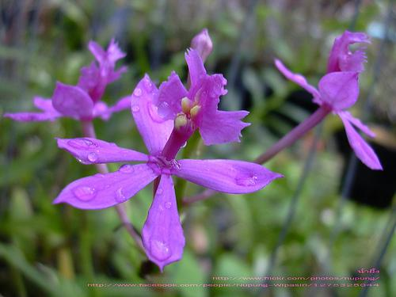
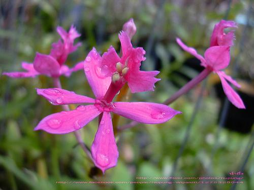

# **S**emantic **I**mage **L**ocal **E**nhancement

This project generates local image enhancements based on given keywords. This repository contains the source code necessary to reproduce the results presented in the paper [**Keyword-based Image Color Re-rendering with Semantic Segmentation**](https://infoscience.epfl.ch/record/231739) (ICIP 2017)

In order to generate semantic segmentation masks, please refer to [Webly Supervised Semantic Segmentation](https://infoscience.epfl.ch/record/227361)

Example:



Using the keyword **Lily**



# Installation

This project uses Python 3.5 and all the libraries can be installed using conda

`conda env create -f environment.yml`

Additionally, you need to download and setup the MIR Flickr 1M database from http://press.liacs.nl/mirflickr/
You can setup the directories according to `src/config_paths.py` or alter this script according to your needs

# Code hierarchy

## Source Code
The main code is in the `src` folder and separated into four main modules:
* `collector`: Module for collecting features and calculating z-values
* `descriptors`: Module for calculating different image descriptors
* `enhancer`: Module for comparing images and keywords and enhancing them
* `filesystem`: Module for reading all kind of files used in the project

It also some common helper files:
* `color_helpers.py`: Color space transformations from RGB, LAB, LCH similar to Lindner's transformations
* `config_paths.py`: Path configuration for images, masks, z-values and everything else, as well as path helpers
* `shared.py`: Shared variables used across multiple modules

The `matlab` directory contains previous scripts used to generate global image enhancement

## Useful scripts
Outside the source folder there are some python scripts that do the following:
* `copy-by-tag.py`: Given a tag name, copies the images from the flickr db into a folder of their own
* `copy-masks.py`: Copies the generated masks into a directory structure similiar to flickr
* `runner.py`: Contains an example to calculate z-values
* `grabcut.py`: Allows to do grabcut on a given image.
Taken from https://github.com/opencv/opencv/blob/master/samples/python/grabcut.py

# Notebooks

There are also a couple of notebooks that I used to generate the results.
They assume you have the following folder hierarchy:

* z-values:
    - keyword1-zvalue.pkl
    - keyword1-zvalue-local.pkl
    - keyword2-zvalue.pkl
    - keyword2-zvalue-local.pkl
* images:
    - keyword1:
        * image1_id.jpg
        * image2_id.jpg
    - keyword2:
        * image3_id.jpg
* masks:
    - keyword1:
        * mask1_id.jpg
        * mask2_id.jpg
    - keyword2:
        * mask3_id.jpg
        
# Citation

Please cite the below when you use our work

```bash
@inproceedings{lahoud2017keyword,
  title={KEYWORD-BASED IMAGE COLOR RE-RENDERING WITH SEMANTIC SEGMENTATION},
  author={Lahoud, Fayez and Ortiz Segovia, Maria S and Jin, Bin and S{\"u}sstrunk, Sabine},
  booktitle={IEEE International Conference on Image Processing (ICIP)},
  number={EPFL-CONF-231739},
  year={2017}
}
```
